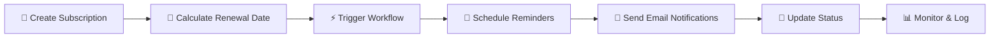

# 🎯 SubDub - Subscription Management API

<div align="center">
**A comprehensive Node.js REST API for managing subscription services with automated renewal reminders**

[](https://nodejs.org/)
[](https://expressjs.com/)
[](https://mongodb.com/)
[](https://jwt.io/)
[](LICENSE)

[Features](#-features) • [Installation](#-installation) • [API Docs](#-api-endpoints) • [Security](#-security-features) • [Contributing](#-contributing)

</div>

---

## ✨ Features

<table>
<tr>
<td width="50%">

### 🔐 **Authentication & Security**
- JWT-based authentication system
- Rate limiting & bot detection
- SQL injection protection via Arcjet
- Secure password hashing with bcrypt

### 📊 **Subscription Management**
- Full CRUD operations for subscriptions
- Multiple currency support (INR, USD, EUR)
- Flexible frequency options (Daily to Yearly)
- Categorized subscription tracking

</td>
<td width="50%">

### 🔔 **Smart Notifications**
- Automated email reminders (7, 5, 2, 1 days before)
- Professional HTML email templates
- Workflow-based reminder system
- Customizable notification schedules

### ⚙️ **Advanced Features**
- Background task automation
- MongoDB integration
- RESTful API design
- Comprehensive error handling

</td>
</tr>
</table>

---

## 🚀 Quick Start

### Prerequisites

- Node.js 18.x or higher
- MongoDB 6.x or higher
- npm or yarn package manager

### Installation

```bash
# 1. Clone the repository
git clone https://github.com/yourusername/subdub.git
cd subdub

# 2. Install dependencies
npm install

# 3. Set up environment variables
cp .env.example .env.development.local
# Edit the file with your configuration

# 4. Start the development server
npm run dev
```

> 🎉 **That's it!** Your SubDub API is now running on `http://localhost:3000`

---

## 🌍 Environment Configuration

Create your environment file (`.env.development.local` or `.env.production.local`):

```env
# 🌐 Server Configuration
PORT=3000
NODE_ENV=development
SERVER_URL=http://localhost:3000

# 🗄️ Database
DB_URI=mongodb://localhost:27017/subdub

# 🔑 JWT Configuration
JWT_SECRET=your-super-secret-jwt-key
JWT_EXPIRES_IN=7d

# 🛡️ Security (Arcjet)
ARCJET_API_KEY=your-arcjet-api-key

# 📧 Email Configuration
NODEMAIL_PASSWORD=your-gmail-app-password

# ⚡ Upstash Workflow
QSTASH_URL=your-qstash-url
QSTASH_TOKEN=your-qstash-token
```

---

## 📡 API Endpoints

### 🔐 Authentication Routes
**Base URL:** `/api/v1/auth`

| Method | Endpoint | Description | Auth Required |
|--------|----------|-------------|---------------|
| `POST` | `/sign-up` | Create new user account | ❌ |
| `POST` | `/sign-in` | Login user | ❌ |
| `POST` | `/sign-out` | Logout user | ❌ |

### 👥 User Routes
**Base URL:** `/api/v1/users`

| Method | Endpoint | Description | Auth Required |
|--------|----------|-------------|---------------|
| `GET` | `/` | Get all users | ✅ |
| `GET` | `/:id` | Get specific user | ✅ |

### 📋 Subscription Routes
**Base URL:** `/api/v1/subscriptions`

| Method | Endpoint | Description | Auth Required |
|--------|----------|-------------|---------------|
| `GET` | `/` | Get all subscriptions | ✅ |
| `GET` | `/:id` | Get specific subscription | ✅ |
| `POST` | `/` | Create new subscription | ✅ |
| `DELETE` | `/:id` | Delete subscription | ✅ |
| `GET` | `/user/:id` | Get user's subscriptions | ✅ |

### ⚙️ Workflow Routes
**Base URL:** `/api/v1/workflows`

| Method | Endpoint | Description | Auth Required |
|--------|----------|-------------|---------------|
| `POST` | `/subscription/reminder` | Trigger reminder workflow | ❌ |

---

## 🏗️ Data Models

### 👤 User Model
```javascript
{
  username: String,      // 2-50 characters, required
  email: String,         // Valid email, required
  password: String,      // Min 6 characters, required
  createdAt: Date,       // Auto-generated
  updatedAt: Date        // Auto-generated
}
```

### 📊 Subscription Model
```javascript
{
  name: String,          // 2-100 characters, required
  price: Number,         // Min 0, required
  currency: Enum,        // ['INR', 'USD', 'EUR']
  frequency: Enum,       // ['Daily', 'Weekly', 'Monthly', 'Yearly']
  category: Enum,        // ['Sports', 'News', 'Entertainment', ...]
  paymentMethod: String, // Required
  status: Enum,          // ['Active', 'Cancelled', 'Expired']
  startDate: Date,       // Required
  renewalDate: Date,     // Auto-calculated
  user: ObjectId,        // Reference to User
  createdAt: Date,       // Auto-generated
  updatedAt: Date        // Auto-generated
}
```

---

## 🛡️ Security Features

<div align="center">

### 🔒 **Multi-Layer Security**

</div>

| Feature | Description | Implementation |
|---------|-------------|----------------|
| **Rate Limiting** | 10 requests per 10 seconds | Arcjet TokenBucket |
| **Bot Detection** | Blocks malicious bots, allows search engines | Arcjet DetectBot |
| **Attack Protection** | SQL injection & common attack prevention | Arcjet Shield |
| **Password Security** | Secure hashing with salt | bcrypt |
| **JWT Authentication** | Stateless token-based auth | jsonwebtoken |

---

## 📧 Email Notification System

### 🗓️ Reminder Schedule
```
📅 7 days before renewal  → Early warning notification
📅 5 days before renewal  → Follow-up reminder
📅 2 days before renewal  → Urgent reminder
📅 1 day before renewal   → Final reminder
```

### ✨ Template Features
- 📱 **Responsive Design** - Looks great on all devices
- 🎨 **Professional Styling** - Modern and clean appearance
- 📊 **Subscription Details** - Complete subscription information
- 🔗 **Action Buttons** - Easy account management links

---

## 💡 Usage Examples

### 1. 👤 User Registration
```bash
curl -X POST http://localhost:3000/api/v1/auth/sign-up \
  -H "Content-Type: application/json" \
  -d '{
    "username": "john_doe",
    "email": "john@example.com",
    "password": "securepassword123"
  }'
```

### 2. 🔐 User Login
```bash
curl -X POST http://localhost:3000/api/v1/auth/sign-in \
  -H "Content-Type: application/json" \
  -d '{
    "email": "john@example.com",
    "password": "securepassword123"
  }'
```

### 3. ➕ Create Subscription
```bash
curl -X POST http://localhost:3000/api/v1/subscriptions \
  -H "Content-Type: application/json" \
  -H "Authorization: Bearer YOUR_JWT_TOKEN" \
  -d '{
    "name": "Netflix Premium",
    "price": 799,
    "currency": "INR",
    "frequency": "Monthly",
    "category": "Entertainment",
    "paymentMethod": "Credit Card",
    "startDate": "2024-01-01"
  }'
```

### 4. 📋 Get User Subscriptions
```bash
curl -X GET http://localhost:3000/api/v1/subscriptions/user/USER_ID \
  -H "Authorization: Bearer YOUR_JWT_TOKEN"
```

---

## 🏗️ Project Architecture

```
subdub/
├── 📁 config/
│   ├── 🔐 arcjet.js          # Security configuration
│   ├── 🌍 env.js             # Environment variables
│   ├── 📧 nodemailer.js      # Email configuration
│   └── ⚡ upstash.config.js  # Workflow configuration
├── 📁 controllers/
│   ├── 🔐 auth.controller.js
│   ├── 📊 subscription.controller.js
│   ├── 👤 user.controller.js
│   └── ⚙️ workflow.controller.js
├── 📁 database/
│   └── 🗄️ mongodb.js
├── 📁 middlewares/
│   ├── 🛡️ arcjet.middleware.js
│   ├── 🔐 auth.middleware.js
│   └── ❌ error.middleware.js
├── 📁 models/
│   ├── 📊 subscription.model.js
│   └── 👤 user.model.js
├── 📁 routes/
│   ├── 🔐 auth.routes.js
│   ├── 🏠 root.routes.js
│   ├── 📊 subscription.routes.js
│   ├── 👤 user.routes.js
│   └── ⚙️ workflow.routes.js
├── 📁 utils/
│   ├── 📧 email-template.js
│   └── 📤 send-email.js
└── 🚀 app.js
```

---

## 🔄 Subscription Lifecycle

<div align="center">



</div>

1. **📝 Creation** - User creates subscription with start date
2. **🧮 Renewal Calculation** - System auto-calculates renewal date
3. **⚡ Workflow Trigger** - Reminder workflow is initiated
4. **📅 Reminder Scheduling** - System schedules email reminders
5. **📧 Email Delivery** - Automated emails sent at intervals
6. **🔄 Status Management** - Subscription status updated based on dates

---

## 📈 Monitoring & Logging

| Component | Description | Status |
|-----------|-------------|--------|
| **⚙️ Workflow Logs** | Track reminder execution | ✅ Active |
| **❌ Error Logging** | Comprehensive error tracking | ✅ Active |
| **🛡️ Security Logs** | Arcjet security events | ✅ Active |
| **🗄️ Database Monitoring** | MongoDB connection status | ✅ Active |

---

## 🤝 Contributing

We welcome contributions! Please follow these steps:

1. 🍴 **Fork** the repository
2. 🌿 **Create** a feature branch (`git checkout -b feature/amazing-feature`)
3. 💾 **Commit** your changes (`git commit -m 'Add some amazing feature'`)
4. 📤 **Push** to the branch (`git push origin feature/amazing-feature`)
5. 🔀 **Open** a Pull Request

### 📋 Development Guidelines

- Write clear, documented code
- Follow existing code style
- Add tests for new features
- Update documentation as needed

---

## 📄 License

This project is licensed under the MIT License - see the [LICENSE](LICENSE) file for details.

---

## 📞 Support & Contact

<div align="center">

**Need help? We're here for you!**


---

<sub>**SubDub** - Making subscription management simple and automated! 🚀</sub>

</div>